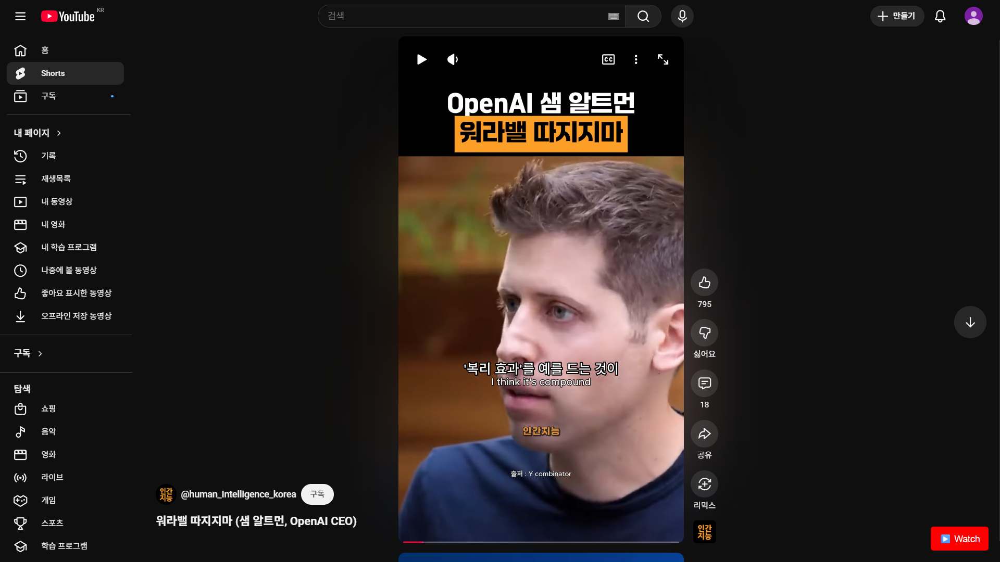
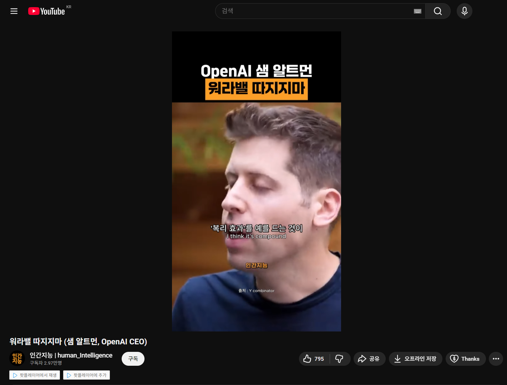

#  Tampermonkey 스크립트 모음 (my-utils-tampermonkey)

개인적인 웹 브라우징 환경의 불편함을 개선하고 생산성을 높이기 위해 작성한 Tampermonkey 유저 스크립트(JavaScript) 모음집입니다.

---

## 🚀 설치 방법 (Setup)

1.  사용 중인 브라우저(Chrome, Edge, Firefox 등)에 **[Tampermonkey 확장 프로그램](https://www.tampermonkey.net/)**을 먼저 설치합니다.
2.  이 저장소에서 설치하려는 `.js` 스크립트 파일(예: `youtube-shorts-to-watch-button.js`)을 클릭합니다.
3.  오른쪽 위에 있는 **[Raw]** 버튼을 클릭합니다.
4.  Tampermonkey가 자동으로 스크립트를 감지하여 설치 페이지를 띄웁니다.
5.  내용을 확인하고 **[Install]** 버튼을 클릭하면 설치가 완료됩니다.

---

## 📜 스크립트 목록 (Scripts)

### 1. YouTube Shorts 'Watch' 버튼 (`youtube-shorts-to-watch-button.js`)

* **문제점 (Why):**
    데스크톱 PC에서 YouTube Shorts 영상을 볼 때, 배속 조절, 10초 앞/뒤로 가기, 영상 탐색 바(progress bar) 등 일반 영상의 편의 기능을 사용할 수 없어 불편했습니다.

* **해결책 (How):**
    YouTube Shorts 페이지(`youtube.com/shorts/*`) 우측 하단에 **`▶️ Watch`** 버튼을 영구적으로 추가합니다.
    * `youtube-shorts-to-watch-button-01.png`를 보시면, 오른쪽 하단에 "Watch" 라는 버튼이 생긴 것을 보실 수 있습니다.
    * 이 버튼을 클릭하면, `youtube-shorts-to-watch-button-02.png`처럼 현재 Shorts 영상이 일반 영상 재생 페이지(`watch?v=...`)로 즉시 리디렉션됩니다.
    * 이를 통해 배속 설정 및 영상 탐색 등 모든 일반 영상 기능을 편리하게 이용할 수 있습니다.

| (1) 'Watch' 버튼 생성 | (2) 일반 영상으로 전환 |
| :---: | :---: |
|  |  |

### 2. 탭 스크롤 동기화 (`tab-scroll-sync.js`)

* **문제점 (Why):**
    외국어 랩 가사나 기술 문서를 볼 때, 모니터 한쪽에는 원문 탭을, 다른 한쪽에는 번역본 탭을 띄워놓고 비교하며 읽어야 했습니다. 이때 양쪽 창의 스크롤 위치를 수동으로 계속 맞추는 것이 매우 번거롭고 시간이 많이 소요되었습니다.

* **해결책 (How):**
    두 개의 서로 다른 브라우저 탭을 하나의 '동기화 그룹'으로 등록할 수 있게 합니다.
    * **사용법:** Tampermonkey 확장 프로그램 아이콘 메뉴에서 'Add to Sync List'를 눌러 탭을 등록합니다.
    * **기능:** 한쪽 탭에서 마우스 휠 스크롤을 하면, 다른 쪽 탭도 정확히 같은 위치로 실시간 동기화되어 스크롤됩니다. 이를 통해 원문과 번역본을 편하게 비교 대조하며 읽을 수 있습니다.